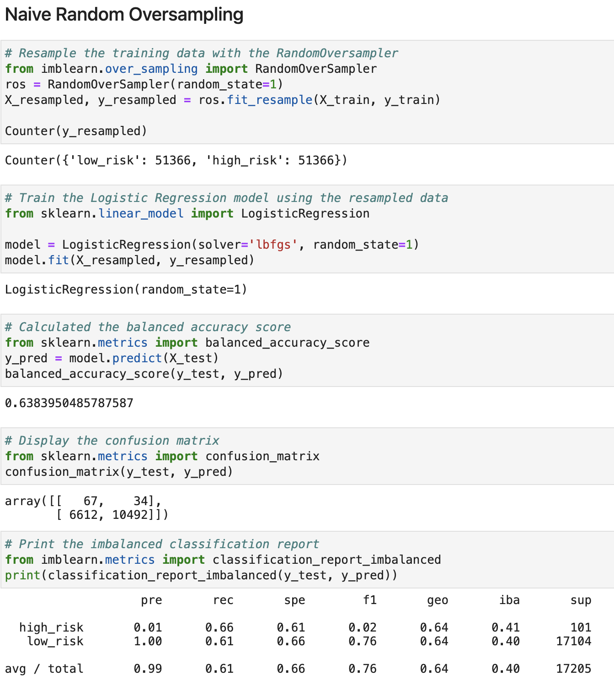
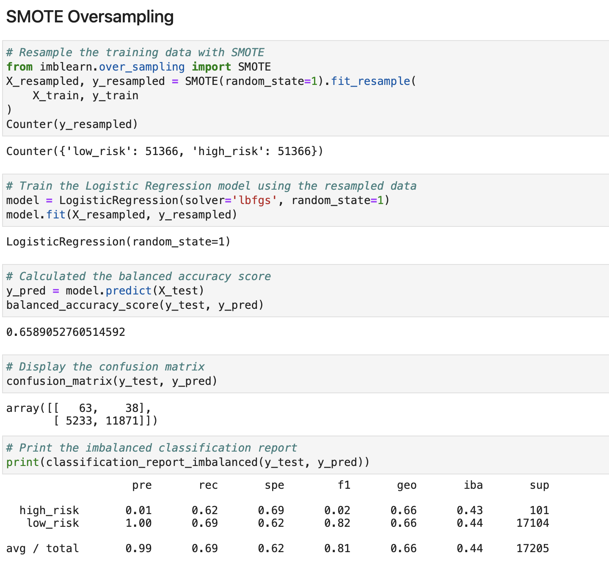
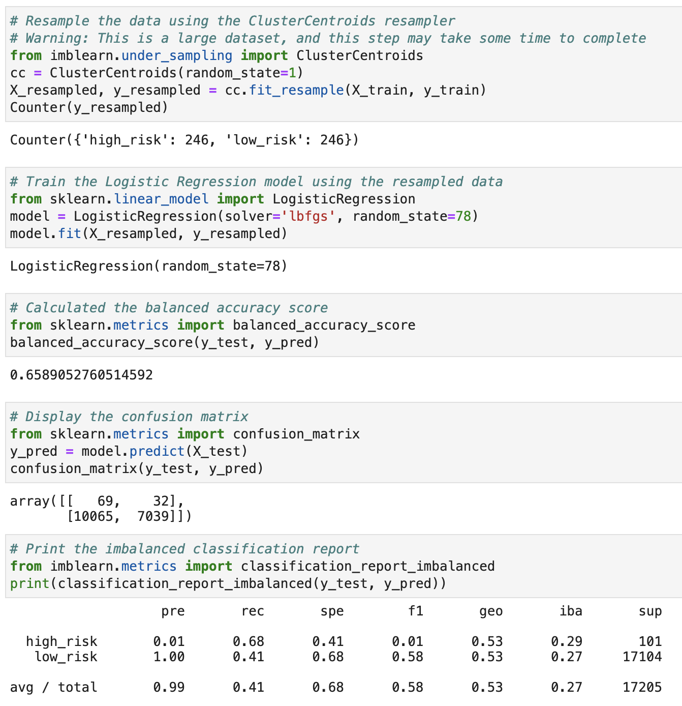
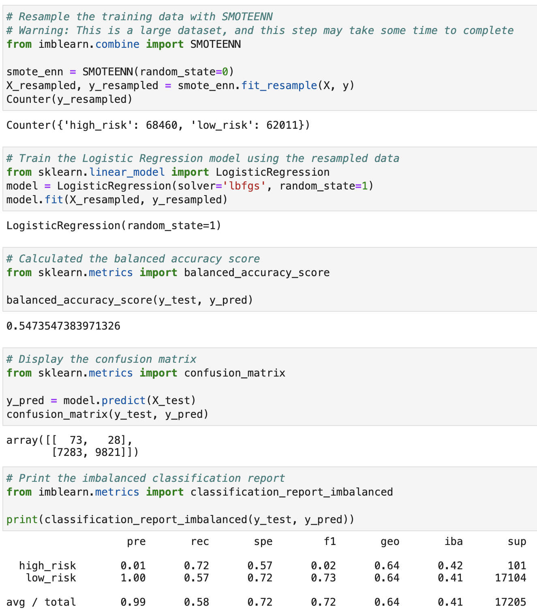
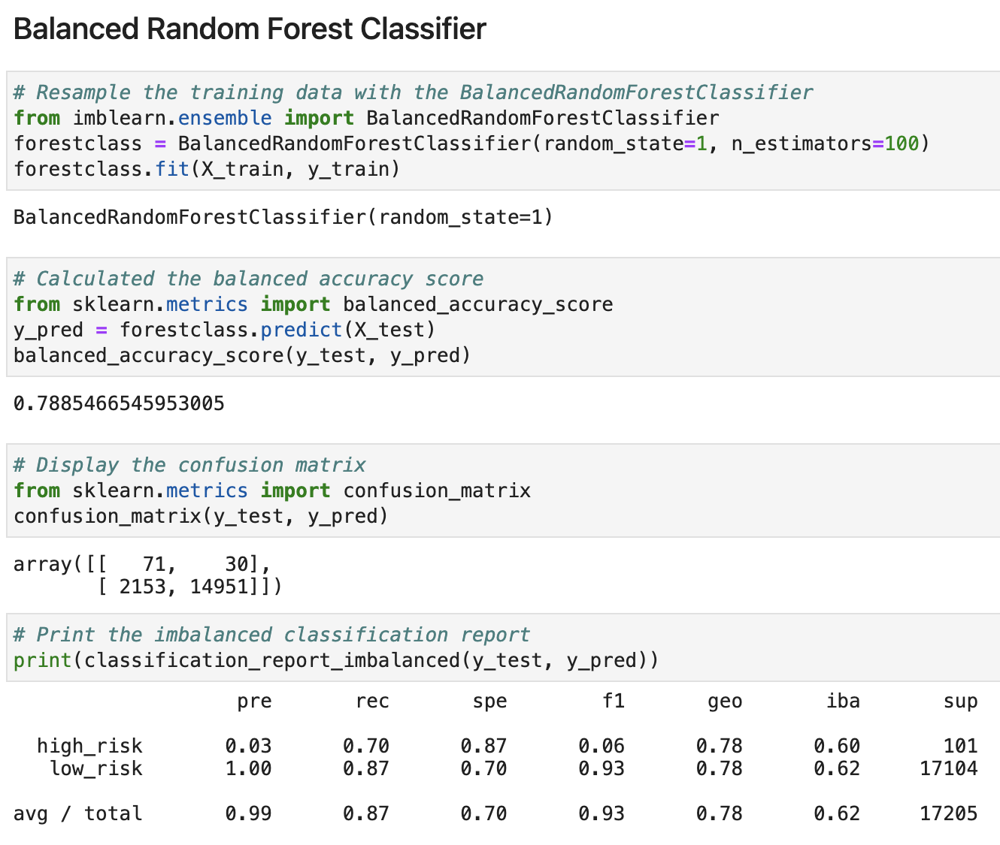
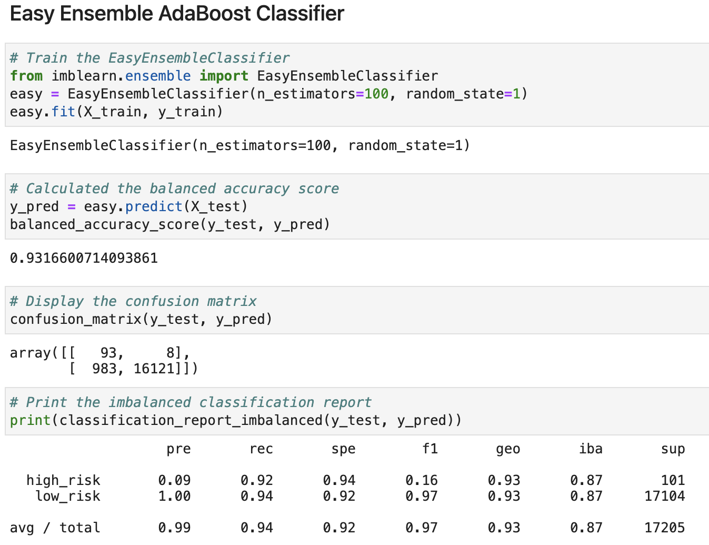

# Credit_Risk_Analysis

## <b>Project Overview</b>
We were hired by a peer-to-peer lending service company called LendingClub to oversample data using their credit card dataset. We will oversample the data using RandomOverSampler and SMOTE algorithms, undersample using ClusterCentroids, and a combinational approach of under and over sampling using the SMOTEENN algorithm. Using two new machine learning models that reduce bias, BalancedRandomForestClassifier and EasyEnsembleClassifier, to predict credit risk.
___
## <b>Resources</b>
Software: Visual Studio Code, Jupyter Notebook/Labs, Python 3.7

Data Source: LoanStats_2019Q1.csv

___
## <b>Results</b>

### RandomOverSampling:
* Balance Accuracy Score: 64%
* Precision: 0.99
* Recall Score:0.61

### SMOTE:
* Balance Accuracy Score: 66%
* Precision: 0.99
* Recall Score: 0.69

### UnderSampling with ClusterCentoids:
* Balance Accuracy Score: 66%
* Precision: 0.99
* Recall Score: 0.41

### SMOTEENN:
* Balance Accuracy Score: 55%
* Precision: 0.99
* Recall Score: 0.58

### Balanced Random Forest Classifier:
* Balance Accuracy Score: 79%
* Precision: 0.99
* Recall Score: 0.87

### Easy Ensemble AdaBoost Classifier:
* Balance Accuracy Score: 93%
* Precision: 0.99
* Recall Score: 0.94

___
## <b>Summary</b>

The randomoversampling, SMOTE, ClusterCentoids, and SMOTEENN did not perform well enough for a credit risk environment. The undersampling, oversampling and a combination all performed between 55%-66%. This is too low and inconsistent to be used. The Balance Random Forest Classifier could be usable, running at a Balance Accuracy Score of 79%. The best Classifier would be the Easy Ensemble Adaboost classifier, running with a balance score of 93% and 0.99 precision.
